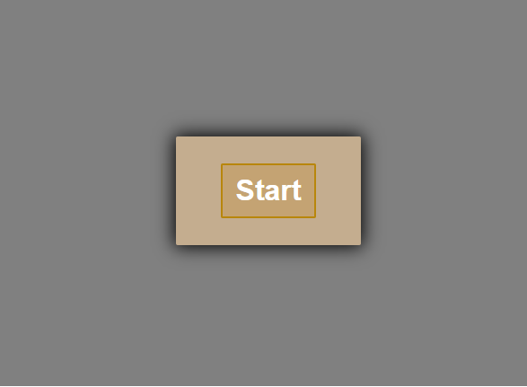
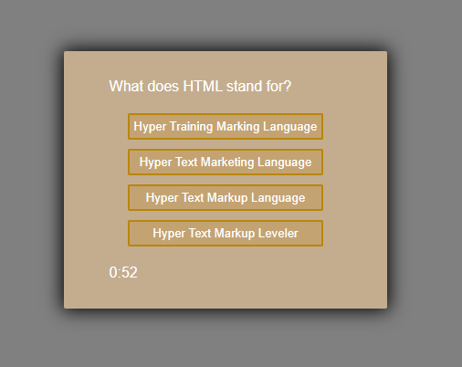
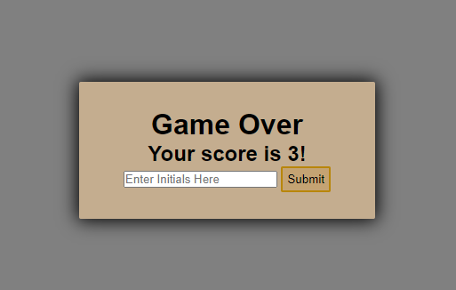
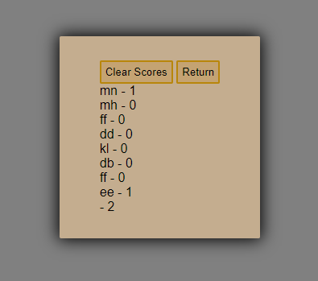

## Code Quiz

This application is a multipe choice quiz with a countdown timer that will record and display initials with high scores at the end of the game.

The background will change colour when you make a choice and let the user know if they got the question right or wrong, with green and red respecetivly.

If they get the question wrong time will be deducted from the clock

[Link ot site](https://gitme-waffles.github.io/Code-Quiz/)

